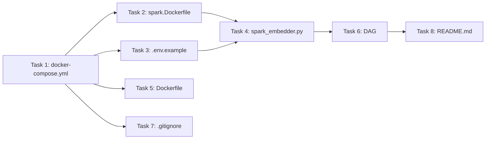

# Plan: Real-time Trending News - Final Architecture

## Architecture Final

```
Crawlers (VnExpress, Kenh14)
    ↓ RSS → Kafka (raw_news)
Spark Streaming (spark_embedder.py)
    ↓ gọi embedding API (OpenAI/Jina)
    ↓ Kafka (processed_data) + Elasticsearch (raw + enriched)
Kibana
    ↓ Dashboard trend / topic / sentiment
```

**Stack:** Kafka + Zookeeper + Spark (Master/Worker) + Elasticsearch + Kibana + Airflow
**Bỏ:** MongoDB, CUDA, ONNX, BERTopic, PyTorch

---

## Task 1: docker-compose.yml — Remove MongoDB, Add ES + Kibana

**File:** `docker-compose.yml`

**Xóa:**
- `services.mongo` (lines 2-13)
- `volumes: mongo-data:` (nếu còn)
- `MONGO_URI` env vars

**Thêm Elasticsearch:**
```yaml
elasticsearch:
    image: docker.elastic.co/elasticsearch/elasticsearch:8.15.0
    container_name: elasticsearch-v4
    environment:
        - discovery.type=single-node
        - xpack.security.enabled=false
        - ES_JAVA_OPTS=-Xms512m -Xmx512m
    ports:
        - "9200:9200"
    volumes:
        - es-data:/usr/share/elasticsearch/data
    networks:
        - trending_news
```

**Thêm Kibana:**
```yaml
kibana:
    image: docker.elastic.co/kibana/kibana:8.15.0
    container_name: kibana-v4
    environment:
        - ELASTICSEARCH_HOSTS=http://elasticsearch:9200
    ports:
        - "5601:5601"
    depends_on:
        - elasticsearch
    networks:
        - trending_news
```

**Thêm volume:**
```yaml
volumes:
    es-data:
```

---

## Task 2: spark.Dockerfile — Remove pymongo

**File:** `spark.Dockerfile`

**Sửa:** Bỏ `pymongo==4.5.0` khỏi pip install (ES dùng `elasticsearch-py` thay thế, hoặc dùng Spark ES connector)

**Cài thêm:** `elasticsearch==8.15.0` (Python client cho Spark driver ghi ES)

---

## Task 3: .env.example — Remove MongoDB config, Add ES config

**File:** `.env.example`

**Xóa:**
```
MONGO_URI=...
MONGO_DB=...
```

**Thêm:**
```
# ========== Elasticsearch ==========
ES_HOSTS=http://elasticsearch-v4:9200
ES_RAW_INDEX=news_raw
ES_PROCESSED_INDEX=news_processed
```

---

## Task 4: processor/spark_embedder.py — Rewrite to write ES instead of MongoDB

**File:** `processor/spark_embedder.py`

**Đã viết:** Spark streaming đọc Kafka, gọi embedding API, ghi vào Kafka.

**Cần sửa hàm `process_batch`:**
1. Bỏ `pymongo` import
2. Bỏ MongoClient + insert_one
3. **Thêm** ghi vào Elasticsearch bằng `elasticsearch-py`:
   - Index `news_raw` (data gốc)
   - Index `news_processed` (data + embeddings)
   
**Cần viết mới thêm trong process_batch:**
```python
from elasticsearch import Elasticsearch, helpers

es = Elasticsearch([ES_HOSTS])

# Bulk write to ES
actions = []
for enriched in enriched_docs:
    action = {
        "_index": ES_PROCESSED_INDEX,
        "_source": enriched
    }
    actions.append(action)
helpers.bulk(es, actions)
```

---

## Task 5: Dockerfile — Remove pymongo from Airflow

**File:** `Dockerfile`

**Sửa:** Bỏ `pymongo==4.5.0` khỏi `pip install`

**Giữ:** `psycopg2-binary, kafka-python, requests, feedparser, beautifulsoup4, python-dotenv`

---

## Task 6: dags/Complete_News_Pipeline_DAG.py — Rewrite monitor to use ES

**File:** `dags/Complete_News_Pipeline_DAG.py`

**Cần sửa:**
1. Bỏ `check_mongodb()` function
2. Bỏ `from pymongo import MongoClient`
3. Sửa `monitor()` dùng ES thay vì Mongo:
```python
def monitor():
    from elasticsearch import Elasticsearch
    es = Elasticsearch(["http://elasticsearch-v4:9200"])
    raw = es.count(index="news_raw")["count"]
    processed = es.count(index="news_processed")["count"]
    logger.info(f"Raw: {raw} | Processed: {processed}")
```

4. Sửa `check_infra` chỉ còn `check_kafka()`
5. Sửa docs/description của DAG

---

## Task 7: .gitignore — Add ES data

**File:** `.gitignore`

**Thêm:**
```
/es-data
```

---

## Task 8: README.md — Update for ES+Kibana

**File:** `README.md`

**Cập nhật:**
- Architecture diagram → Kafka → Spark → ES → Kibana
- Services table → add ES (9200), Kibana (5601)
- Bỏ MongoDB references
- Thêm Kibana dashboard guide

---

## Summary: Changed Files vs New Files vs Deleted

### Files đã sửa (cần commit):
| File | Status | Notes |
|------|--------|-------|
| `docker-compose.yml` | Sửa | Bỏ Mongo, thêm ES + Kibana |
| `spark.Dockerfile` | Sửa | Bỏ pymongo, thêm elasticsearch-py |
| `.env.example` | Sửa | Bỏ Mongo config, thêm ES config |
| `processor/spark_embedder.py` | Sửa | Bỏ Mongo, thêm ES client |
| `Dockerfile` | Sửa | Bỏ pymongo |
| `dags/Complete_News_Pipeline_DAG.py` | Sửa | Bỏ Mongo check, dùng ES monitor |
| `.gitignore` | Sửa | Thêm /es-data |
| `README.md` | Sửa | ES + Kibana docs |

### Files đã xóa so với dev:
```
dags/All_Consumer_DAG.py
dags/Embedding_Processing_DAG.py
dags/Kenh14_Producer_DAG.py
dags/Vnexpress_Producer_DAG.py
crawler/test_consumer.py
crawler/test_kafka_connection.py
entrypoint.sh
mongo-init.js
src/Topic_Sentiment.py
src/Topic_Sentiment_Model/TopicModel.py
processor/raw_data_consumer.py
processor/processed_data_consumer.py
processor/simple_spark_processor.py
processor/spark_embedding_processor.py
processor/spark_onnx_processor.py
processor/working_embedding_processor.py
processor/embedder.py          (created then deleted)
test_simple_embedding.py
test_word_segmentation.py
checkpoints/
models/
jars/ (recreated empty)
es-data/ (gitignored)
```

### Files mới so với dev:
| File | Purpose |
|------|---------|
| `.env.example` | Config template |
| `processor/spark_embedder.py` | Spark job mới gọi API + ghi ES |

---

## Pipeline Flow (Airflow DAG)

```
start → check_infra (Kafka) → ensure_spark_containers
    → ensure_spark_embedder → [crawler_vne, crawler_k14] → monitor → end
```

Monitor dùng ES count index thay vì MongoDB.

---

## Kibana Dashboard Plan

Sau khi ES có data, cần tạo:
1. **Index Pattern:** `news_processed`
2. **Dashboard:**
   - Số bài viết theo thời gian (line chart)
   - Top sources (pie chart)
   - Top categories (bar chart)
   - Sentiment phân bố (nếu có)
   - Recent articles table

---

## Task Execution Order



1. docker-compose.yml (thêm ES + Kibana, xóa Mongo)
2. spark.Dockerfile (sửa pip deps)
3. .env.example (sửa config)
4. Dockerfile (bỏ pymongo)
5. spark_embedder.py (ES thay Mongo)
6. DAG (sửa monitor)
7. .gitignore (thêm es-data)
8. README.md (update docs)
